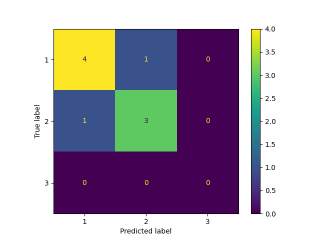

# Raport znalezienia modelu do predykcji allNBA team

## Dane wejściowe
### 1. Pobranie danych
Na początku zapoznano się z biblioteką nba_api, która pozwala na pobieranie statystyk graczy NBA. Napotkano wiele problemów - brak zrozumienia ubogiej dokumentacji i ograniczenia w pobieraniu danych - iterowanie po graczach i pobieranie ich statystyk spotykało się z błędami. Zdecydowano się na zapisanie danych lokalnie - plik csv, szybko zmieniono podejście na zapisywanie do formatu pickle - modyfikacja przykładu znalezionego w internecie. Zmieniono także podejście na pobieranie danych za pomocą web scraping, co pozwoliło na łatwiejsze i bardziej elastyczne pobieranie danych.
Przykład pobierania danych z nba_api:
<details>
  <summary>Old fetch function</summary>


```python
def get_stats(player_full_name : str) -> pd.DataFrame:
    player_id_ = players.find_players_by_full_name(player_full_name)[0]['id']
    stats = playercareerstats.PlayerCareerStats(player_id=player_id_)
    return stats.get_data_frames()[0]

def get_players_stats_season(season : str) -> pd.DataFrame:
    stats = leaguedashplayerstats.LeagueDashPlayerStats(season=season)
    stats = stats.get_data_frames()[0]
    stats : pd.DataFrame = stats[['PLAYER_ID', 'PLAYER_NAME', 'AGE', 'GP', 'W', 'L', 'W_PCT', 'MIN', 'FGM', 'FGA', 'FG_PCT', \
            'FG3M', 'FG3A', 'FG3_PCT', 'FTM', 'FTA', 'FT_PCT', 'OREB', 'DREB', 'REB', 'AST', \
            'TOV', 'STL', 'BLK', 'BLKA', 'PF', 'PFD', 'PTS', 'PLUS_MINUS', 'NBA_FANTASY_PTS', 'DD2', 'TD3']]
    return stats
```

</details>

Zastąpiono to poniższym, `fetch_data()`, można tą funkcję wykonywać za pomocą uruchomienia skryptu [`nba_dataset.py`](../lib/nba_dataset.py). Pliki zapisywane są w formacie `ostatni_człon_linku_bez_html.pkl` :
<details>
  <summary>Current fetch function</summary>
  
```python
def fetch_data(season, Teams=False):
    season = str(season)
    urls = [f'https://www.basketball-reference.com/leagues/NBA_{season}_totals.html',
            f'https://www.basketball-reference.com/leagues/NBA_{season}_advanced.html',
            f'https://www.basketball-reference.com/leagues/NBA_{season}_per_game.html',
            f'https://www.basketball-reference.com/leagues/NBA_{season}_shooting.html',
            f'https://www.basketball-reference.com/leagues/NBA_{season}_standings.html',
            f'https://www.basketball-reference.com/leagues/NBA_{season}_rookies.html']

    if Teams:
        urls.append('https://www.basketball-reference.com/awards/all_league.html')
        urls.append('https://www.basketball-reference.com/awards/all_rookie.html')

    for url in urls:
        response = requests.get(url)
        response.raise_for_status()  # Raise an exception for HTTP errors
        response.encoding = response.apparent_encoding
        soup = BeautifulSoup(response.text, 'html.parser')
        table = soup.find_all('table')
        # If there are 4 tables it is teams standings
        match = re.search(r'/([^/]+)\.html', url)
        if url == urls[4]:
            for i in [0, 1]:
                df = pd.read_html(StringIO(str(table[i])))[0]
                with open(f'data/{match.group(1)}_{i}.pkl', 'wb') as f:
                    pickle.dump(df, f)
        else:
            df = pd.read_html(StringIO(str(table[0])))[0]
            with open(f'data/{match.group(1)}.pkl', 'wb') as f:
                pickle.dump(df, f)
```
</details>

Jeżeli chcemy uzyskać konkretne dane funkcja `_load_data()` sprawdzi, czy są one już zapisane w formacie pickle w folderze `data/`, jeżeli nie, to pobierze je z internetu i zapisze w tym folderze funkcją `fetch_data()`. 
<details>
  <summary>Wrapper for fetch function</summary>
  
```python
def _load_data(file_path: str, season: str) -> pd.DataFrame:
    season = str(season)
    current_year = datetime.now().year
    if not (season.isdigit() and len(season) == 4 and 1947 <= int(season) <= current_year):
        raise ValueError(f"season must be a 4-digit year string between 1947 and {current_year}, got '{season}'")
    if not os.path.exists(file_path):
        fetch_data(season, Teams=True)
    with open(file_path, 'rb') as f:
        df = pickle.load(f)
    if isinstance(df.columns, pd.MultiIndex):
        df.columns = [
            f"{lvl0}_{lvl1}" if lvl1 and not lvl0.lower().startswith('unnamed') else lvl1
            for lvl0, lvl1 in zip(df.columns.get_level_values(0), df.columns.get_level_values(-1))
        ]
    return df
```
</details>

### 2. Wstępne przetwarzanie i łączenie danych
Każda pobrana tabela zapisana w formacie pickle jest przetwarzana w celu połączenia wszystkich danych w jedną tabelę - wczytywaną za pomocą `load_nba()`:

```python
all_nba_df = _get_all_nba_players(SEASON)
df = _get_players_stats_season_bs4(SEASON)
df, _ = _group_standard_rookies(SEASON, df)
```

lub dla Rookies - `load_rookies()`.:
```python
all_rookie_df = _get_all_rookie_players(SEASON)
df = _get_players_stats_season_bs4(SEASON)
_, df = _group_standard_rookies(SEASON, df)
```

Rozpiszmy kroki wykonywane dla każdej z funkcji przetwarzających dane:
- `_get_all_nba_players(SEASON)` - wczytuje informacje o zawodnikach wybranych do zespołów allNBA, usuwa niepotrzebne kolumny, przekształca dane i zwraca DataFrame z zawodnikami i numerem zespołu allNBA do którego zostali wybrani.

    <details>
    <summary>Wczytanie graczy z zespołów allNBA</summary>
    
    ```python
    def _get_all_nba_players(season : str) -> pd.DataFrame:
        df = _load_data('data/all_league.pkl', season)
        df = df.dropna(axis='index')
        df = df.drop(['Voting', 'Lg'], axis='columns')
        df = df.rename(columns={"Tm": "Team", 'Unnamed: 4': "Player1", 'Unnamed: 5': "Player2", 'Unnamed: 6': "Player3", 'Unnamed: 7': "Player4", 'Unnamed: 8': "Player5"})
        pd.set_option('future.no_silent_downcasting', True)
        df = df.replace(['1st', '2nd', '3rd'], [1, 2, 3])
        df = df.map(lambda x: x.rsplit(' ', 1)[0] if isinstance(x, str) else x)
        df['Season'] = df['Season'].apply(lambda s: str(int(s[:4]) + 1) if isinstance(s, str) and '-' in s else s)
        all_league_df = df.set_index(['Season', 'Team'])
        if season is not None:
            all_league_df = all_league_df.loc[season].reset_index().melt(
                id_vars=['Team'],
                value_vars=['Player1', 'Player2', 'Player3', 'Player4', 'Player5'],
                var_name='Player_Position',
                value_name='Player'
            )[["Player", "Team"]]
        return all_league_df
    ```
    </details>
- `_get_all_rookie_players(SEASON)` - analogicznie do powyższej funkcji, wczytuje informacje o zawodnikach wybranych do zespołów allRookie.

    <details>
    <summary>Wczytanie graczy z zespołów allRookies</summary>
    
    ```python
    def _get_all_rookie_players(season : str) -> pd.DataFrame:
        df = _load_data('data/all_rookie.pkl', season)
        df = df.dropna(axis='index')
        df = df.drop(['Voting', 'Lg'], axis='columns')
        df = df.rename(columns={"Tm": "Team", 'Unnamed: 4': "Player1", 'Unnamed: 5': "Player2", 'Unnamed: 6': "Player3", 'Unnamed: 7': "Player4", 'Unnamed: 8': "Player5"})
        pd.set_option('future.no_silent_downcasting', True)
        df = df.replace(['1st', '2nd'], [1, 2])
        df['Season'] = df['Season'].apply(lambda s: str(int(s[:4]) + 1) if isinstance(s, str) and '-' in s else s)
        all_rookie_df = df.set_index(['Season', 'Team'])
        if season is not None:
            all_league_df = all_rookie_df.loc[season].reset_index().melt(
                id_vars=['Team'],
                value_vars=['Player1', 'Player2', 'Player3', 'Player4', 'Player5'],
                var_name='Player_Position',
                value_name='Player'
            )[["Player", "Team"]]
        return all_league_df
    ```
    </details>
- `_get_players_stats_season_bs4(SEASON)` - Funkcja ta wczytuje statystyki wszystkich graczy z sezonu - statystyk z zakładek `totals`, `advanced`, `per_game`, `shooting` oraz za pomocą `_get_standing_teams(SEASON)` wczytuje także informacje o drużynach. Następnie łączy wszystkie dane w jeden DataFrame, usuwa duplikaty - jeżeli nazwy kolumn się powtarzają, dodaje odpowiednie sufiksy, aby uniknąć konfliktów. Następnie przetwarza dane, aby wybrać odpowiednie wiersze dla graczy, którzy grali w wielu drużynach we wczyztanym sezonie. Na końcu dodaje informacje o statystykach drużyny do DataFrame. W przypadku graczy, którzy grali w wielu drużynach, wybiera ostatnią drużynę, w której grali.

    <details>
    <summary>Wczytanie statystyk wszystkich graczy</summary>
    
    ```python
    def _get_players_stats_season_bs4(season : str) -> pd.DataFrame:
        df_totals   = _load_data(f'data/NBA_{season}_totals.pkl', season)
        df_advanced = _load_data(f'data/NBA_{season}_advanced.pkl', season)
        df_per_game = _load_data(f'data/NBA_{season}_per_game.pkl', season)
        df_shooting = _load_data(f'data/NBA_{season}_shooting.pkl', season)
        teams = _get_standing_teams(season)
        # Clean and prepare DataFrames
        for d in [df_totals, df_advanced, df_per_game, df_shooting]:
            d.drop(d[d['Player'] == 'League Average'].index, inplace=True)
            d.sort_values(['Player', 'Age'], inplace=True)
            d.reset_index(drop=True, inplace=True)

        # Merge all DataFrames on Player and Team, handling common columns with different values
        def merge_dfs(left, right, left_name, right_name):
            # Find common columns (excluding keys)
            common = [col for col in left.columns if col in right.columns and col not in ['Player', 'Team']]
            # For each common column, check if values differ; if so, add suffixes
            for col in common:
                if not left[col].equals(right[col]):
                    left.rename(columns={col: f"{col}_{left_name}"}, inplace=True)
                    right.rename(columns={col: f"{col}_{right_name}"}, inplace=True)
            # Drop duplicate columns from right (except keys)
            right_to_merge = right[[c for c in right.columns if c not in left.columns or c in ['Player', 'Team']]]
            return pd.merge(left, right_to_merge, on=['Player', 'Team'], how='inner')

        df = merge_dfs(df_totals, df_advanced, 'totals', 'advanced')
        df = merge_dfs(df, df_per_game, 'totadv', 'per_game')
        df = merge_dfs(df, df_shooting, 'totadvpg', 'shooting')

        multi_team_players = df[df['Team'].str.endswith('TM', na=False)]['Player'].unique()

        last_team_map = (
            df[df['Player'].isin(multi_team_players) & (~df['Team'].str.endswith('TM', na=False))]
            .groupby('Player')
            .last()['Team']
            .to_dict()
        )

        def pick_row(player_rows):
            if player_rows['Team'].str.endswith('TM', na=False).any():
                row = player_rows[player_rows['Team'].str.endswith('TM', na=False)].iloc[0].copy()
                if row['Player'] in last_team_map:
                    row['Team'] = last_team_map[row['Player']]
                return row
            else:
                return player_rows.iloc[0]

        df = df.groupby('Player', group_keys=False).apply(pick_row).reset_index(drop=True)

        for id_x, player in df.iterrows():
            player_team = player['Team']
            for col in list(teams.columns):
                if f'{col}_team' not in df.columns:
                    df[f'{col}_team'] = object()
                # Find the row in teams where 'Team' matches player's team
                if 'Team' in teams.columns and player_team in teams['Team'].values:
                    value = teams.loc[teams['Team'] == player_team, col].values
                    if len(value) > 0:
                        # Assign value directly without type casting to avoid ValueError for strings
                        df.at[id_x, f'{col}_team'] = value[0]

        return df
    ```
    </details>

- `_get_standing_teams(SEASON)` - Z powodu, że za pomocą BeautifulSoup nie udało się pobrać 5-tej tabeli ze strony z statystykami zespołów, funkcja ta wczytuje dwa pliki pickle z danymi o drużynach z konfederacji wschodniej i zachodniej i łączy je w jeden DataFrame. Funkcja usuwa niepotrzebne kolumny, zmienia nazwy kolumn, usuwa puste wiersze i usuwa znaki `*` z końca nazw drużyn. Na końcu zamienia nazwy drużyn na skróty.
    <details>
    <summary>Wczytanie Dataframe z statystykami zespołów</summary>
    
    ```python
    def _get_standing_teams(season: str):
        df0 = _load_data(f'data/NBA_{season}_standings_0.pkl', season)
        df1 = _load_data(f'data/NBA_{season}_standings_1.pkl', season)
        # Remove the first row if it's a header row (sometimes happens with pd.read_html)
        if isinstance(df0.iloc[0, 1], str) and df0.iloc[0, 1] == 'W':
            df0 = df0.iloc[1:].reset_index(drop=True)
        if isinstance(df1.iloc[0, 1], str) and df1.iloc[0, 1] == 'W':
            df1 = df1.iloc[1:].reset_index(drop=True)
        # Rename first column to 'Team' for both
        df0 = df0.rename(columns={df0.columns[0]: "Team"})
        df1 = df1.rename(columns={df1.columns[0]: "Team"})
        # Keep only the first 8 columns (team name + 7 stats)
        df0 = df0.iloc[:, :8]
        df1 = df1.iloc[:, :8]
        # Remove possible summary/empty rows
        df0 = df0[df0['Team'].notna() & (df0['Team'] != '')]
        df1 = df1[df1['Team'].notna() & (df1['Team'] != '')]
        # Remove '*' from end of team names if present
        df0['Team'] = df0['Team'].str.rstrip('*')
        df1['Team'] = df1['Team'].str.rstrip('*')
        # Replace team names with abbreviations
        df0['Team'] = df0['Team'].replace(NBA_TEAM_ABBREVIATIONS)
        df1['Team'] = df1['Team'].replace(NBA_TEAM_ABBREVIATIONS)
        return pd.concat([df0, df1], axis=0, ignore_index=True)
    ```
    </details>

- `_group_standard_rookies(SEASON, df)` - Funkcja ta dzieli DataFrame z graczami na dwie części - standardowych graczy i rookies. Wczytuje dane o rookies z pliku `NBA_{season}_rookies.pkl`, a następnie filtruje DataFrame, aby uzyskać dwie oddzielne DataFrame.
    <details>
    <summary>Podział graczy standardowych i rookies</summary>
    
    ```python
    def _group_standard_rookies(season: str, df : pd.DataFrame):
        df_rookies = _load_data(f'data/NBA_{season}_rookies.pkl', season)
        rookie_players = set(df_rookies['Player'])
        df_standard = df[~df['Player'].isin(rookie_players)].copy()
        df_rookie = df[df['Player'].isin(rookie_players)].copy()
        return df_standard, df_rookie
    ```
    </details>

Po uzyskaniu wszystkich danych tworzymy kolumnę `All_NBA_Team` która zawiera informacje o tym, do którego zespołu allNBA został wybrany dany gracz lub 0 w przypadku gdy nie został wybrany. Resetujemy i ustalamy indeks tak aby był unikalny dla każdego gracza i taki sam dla wszystkich DataFrame zawartych w naszym obiekcie `Bunch()`. Uzyskujemy osobny DataFrame z imionami zawodników, oraz uzupełniamy pozostałymi cechami inne pola. Przy tworzeniu obiektu `Bunch()` z danymi wzorowano się na strukturę danych z biblioteki `sklearn.datasets`, co pozwala na łatwe korzystanie z tych danych w modelach uczenia maszynowego. Docelowo funkcja `load_nba()` jest wzorowana na np. `load_iris()`. Struktura obiektu `Bunch()`:
```python
return Bunch(
    data=data_df,
    target=target_df,
    record=record,
    frame=combined_df,
    target_names=target_name,
    DESCR=fdescr,
    feature_names=feature_names,
    data_module="sklearn.datasets.data",
)
```
<details>
<summary>Cała funkcja load_nba</summary>

```python
def load_nba(SEASON = '2023'):
    all_nba_df = _get_all_nba_players(SEASON)
    df = _get_players_stats_season_bs4(SEASON)
    df, _ = _group_standard_rookies(SEASON, df)

    nba_team = np.zeros(len(df), dtype=object)
    for i, (_, row) in enumerate(df.iterrows()):
        if row['Player'] in all_nba_df['Player'].values:
            nba_team[i] = int(all_nba_df[all_nba_df['Player'] == row['Player']].Team.values[0])
        else:
            nba_team[i] = int(0)

    # df = df.sort_values('Rk_totals')
    # df = df.set_index('Rk_totals')
    df = df.reset_index(drop=True)
    record = df['Player']
    df = df.drop(['Player'], axis=1)
    feature_names = df.columns.values
    target_name = 'ALL_TEAM'

    # Only keep columns that can be converted to float
    numeric_cols = []
    for col in df.columns:
        try:
            df[col].astype(float)
            numeric_cols.append(col)
        except (ValueError, TypeError):
            continue

    data_df = pd.DataFrame(df[numeric_cols].values, columns=numeric_cols, copy=False)
    target_df = pd.Series(nba_team, name=target_name, index = data_df.index)
    combined_df = pd.concat([data_df, target_df], axis=1)

    fdescr = """ DATASET OF STANDARD PLAYERS IN NBA """

    return Bunch(
        data=data_df,
        target=target_df,
        record=record,
        frame=combined_df,
        target_names=target_name,
        DESCR=fdescr,
        feature_names=feature_names,
        data_module="sklearn.datasets.data",
    )
```
</details>

Funkcja `load_rookies()` działa analogicznie do `load_nba()`, ale niestety z powodu niescisłości niektórych imion i braku player_id tak jak w bibliotece nba_api konieczna była modyfikacja niektórych imion i nazwisk za pomocą poniższego kodu:
```python
player_name_replacements = {
    "GG Jackson II": "Gregory Jackson",
    "Dereck Lively II": "Dereck Lively",
    "Jaime Jaquez Jr.": "Jaime Jaquez"
}
df['Player'] = df['Player'].replace(player_name_replacements)
```
### 3. Analiza danych i zaawansowana filtracja danych
W celu zmniejszenia ilości cech i wykorzystaniu również klasyfikatora `GradientBoostingClassifier` z biblioteki `sklearn`, przeprowadzono analizę korelacji pomiędzy cechami, aby wyodrębnić te, które pokrywają się ze sobą. Do analizy użyto skryptu [`log_plots.py`](../archive/log_plots.py), skrypt ten również zapisywał dane do mlflow, a zatem po uruchomieniu serwera mlflow na adresie `http://127.0.0.1:8080` poniższe linki przeniosą nas do omawianych wpisów:
#### Analiza korelacji wszystkich cech dla graczy debiutujących w NBA dla sezonów 2000-2025
Zapisane wykresy pokazujące korelację z targetem i pary cech z korelacją powyżej 0.9 znajdują się pod [linkiem](http://127.0.0.1:8080/#/experiments/294386150213064227/runs/ac594ae79ac54cef897fb56dd0073bc7/artifacts). Możemy zaobserwować 72 pary cech, które mają korelację powyżej 0.9 ich ilość po [rozmowie z chatem GPT](https://chatgpt.com/share/6841e30e-e994-800f-9f08-afc694489302)
zmniejszono do 4 co można zobaczyć w tym [wpisie danych](http://127.0.0.1:8080/#/experiments/294386150213064227/runs/92f4de5eeb9942b48d6f0cb836899252/artifacts). Porównano to z [zawodnikami rookies, którzy zostali wybrani do zespołów allRookie w sezonach 2000-2025](http://127.0.0.1:8080/#/experiments/294386150213064227/runs/94f038f04c914dda8cbb81567a87a5fe/artifacts), jednak nie zauważono żadnych istotnych relacji i zależności pomiędzy cechami, które mogłyby wskazywać na to, że niektóre cechy są bardziej istotne przy wyborze graczy do zespołów allRookie. Mowa tutaj o wykresach `feature x vs target corr`. Które dla graczy NBA i zawodników z zespołu allNBA pokazały ciekawe zależności i pomogły w odfiltrowaniu graczy, którzy mieli mniejsze szanse na dostanie się do zespołu allNBA. Wykresy z analizy korelacji cech z target dla graczy Rookies:


#### Analiza korelacji wszystkich cech dla graczy nie debiutujących w NBA dla sezonów 2000-2025
Analogicznie jak dla graczy Rookies przeprowadzono analizę korelacji dla [wszystkich graczy NBA](http://127.0.0.1:8080/#/experiments/294386150213064227/runs/13cef9b381484925ad26b9a24a64b821/artifacts) i uzyskano aż 82 silnie skorelowane cechy. Po [rozmowie z chatem GPT](https://chatgpt.com/share/6841e30e-e994-800f-9f08-afc694489302)
zdecydowano się na zmniejszenie tej [liczby do 1 cechy](http://127.0.0.1:8080/#/experiments/294386150213064227/runs/dff34a8f0c304ef8abd6890cefc99137/artifacts). Sprawdzono tak ograniczone cechy dla graczy wybranych do zespołów [allNBA w sezonach 2000-2025](http://127.0.0.1:8080/#/experiments/294386150213064227/runs/a4bc8c8694aa4951a70d5b4dc8630448/artifacts) i zauważono, kilka ciekawych zależności, w kombinacji z ogólnymi minimalnymi założeniami co do graczy wybieranych do zespołów allNBA sformułowano cechy które zawodnik musi spełnić, aby był rozpatrywany w modelu:
```python
mask_low_chances = (((df.data['GS'] / df.data['G']) < 0.9) |
                    (df.data['BPM'] < -0.5) |
                    (df.data['VORP'] < 1) |
                    (df.data['PER'] < 10) |
                    (df.data['G'] < 50)
                    )        
```
Na poparcie tych założeń, proszę zobaczyć wykresy `feature x vs target corr` dla graczy z zespołu allNBA, oraz plik `gs_comparison.txt`, który pokazuje że do zespołu allNBA trafiali głównie gracze, którzy zaczynali w większości meczów w pierwszym składzie - metryki `GS` i `G`.
Poniżej załączono wykresy z analizy korelacji cech z target dla graczy NBA:


#### Implementacja w kodzie
Powyższe wnioski wykorzystano i zaimplementowano w kodzie w funkcji `filter_dataset`:

<details>
<summary>Filtracja i uzupełnienie danych na podstawie analizy korelacji</summary>

```python
def filter_dataset(df : pd.DataFrame, rookies=False, fill_na=None, debug=False, old_ver=False, drop_low_chances=False):
    if debug:
        print(f'len(df.data): {len(df.data)}')
        print(f'len(df.data.columns): {len(df.data.columns)}')
        print("Rows with NA values in df:")
        print(df.data[df.data.isna().any(axis=1)])

    # df.data = df.data.reset_index(drop=True)
    # df.target = df.target.reset_index(drop=True)
    if rookies:
        cols_to_drop = ['Awards', 'MP_totadv', 'FG_totadv',       
                        'FGA_totadv', '2P_totadv',
                        '2PA_totadv', 'PTS_totadv',    
                        '3PA_totadv', 'FT_totadv',
                        'FTA_totadv', 'TRB_totadv',
                        'DRB_totadv', 'ORB_totadv',
                        'TOV_totadv', 'PF_totadv',
                        'Rk_advanced', 'Rk_totadvpg',
                        'eFG%', '% of FGA by Distance_2P',
                        'WS/48', 'OBPM',
                        '3PA_per_game','2PA_per_game',
                        'PTS_per_game', 'Rk_shooting',
                        'FG% by Distance_3P', 'FGA_per_game',
                        '2P_per_game', 'FTA_per_game',
                        'DRB_per_game', '2P%'
                        ]
    else:
        if old_ver:
            cols_to_drop = ['MP_totadv', 'Rk_advanced',
                            'FG_totadv', 'FGA_totadv', 'PTS_totadv',
                            '2P_totadv', '2PA_totadv',
                            'FT_totadv', 'FTA_totadv',
                            'ORB_totadv', 'DRB_totadv', 'TRB_totadv',
                            'TOV_totadv', 'AST_totadv', 'BLK_totadv',
                            'FG_per_game', 'FGA_per_game',
                            '2P_per_game', '2PA_per_game',
                            '3P_totadv', '3PA_totadv', '3P_per_game', '3PA_per_game',
                            'FT_per_game', 'FTA_per_game',
                            'Rk_totadvpg', 'OBPM', 'WS',
                            '3PAr','TRB%', 'W_team', 'L_team',
                            'FG% by Distance_3P', 'eFG%',               
                            'DRB_per_game', 'Rk_shooting',
                            '% of FGA by Distance_2P', 'W/L%_team', "2P%"
                            ]
        else:
            cols_to_drop = ['Awards', 'MP_totadv', 'FG_totadv', 'FGA_totadv', 'PTS_totadv', '2P_totadv', '2PA_totadv', 'FT_totadv', 'FTA_totadv',
                            'ORB_totadv', 'DRB_totadv', 'TRB_totadv', 'TOV_totadv', 'AST_totadv', 'BLK_totadv', 'STL_totadv',
                            'FG_per_game', 'FGA_per_game', '2P_per_game', '2PA_per_game', '3P_per_game', '3PA_per_game',
                            'FT_per_game', 'FTA_per_game', 'Rk_advanced', 'Rk_totadvpg', 'Rk_shooting',
                            'FG% by Distance_3P', 'FG% by Distance_2P', '% of FGA by Distance_2P', '% of FGA by Distance_3P',
                            '% of FGA by Distance_0-3', '% of FGA by Distance_3-10', '% of FGA by Distance_10-16',
                            '% of FGA by Distance_16-3P', '% of FG Ast\'d_2P', '% of FG Ast\'d_3P', 'Corner 3s_3P%',
                            'Corner 3s_%3PA', 'FG% by Distance_0-3', 'FG% by Distance_3-10', 'FG% by Distance_10-16',
                            'FG% by Distance_16-3P', 'Dunks_%FGA', 'OBPM', 'WS', 'TRB%', 'W_team', 'L_team', 'W/L%_team', '2P%']
            if drop_low_chances:
                mask_low_chances = (
                                    ((df.data['GS'] / df.data['G']) < 0.9) |
                                    (df.data['BPM'] < -0.5) |
                                    (df.data['VORP'] < 1) |
                                    (df.data['PER'] < 10) |
                                    (df.data['G'] < 50)
                                    )            
                mask_low_chances.index = df.data.index
                df.data = df.data[~mask_low_chances].reset_index(drop=True)
                df.target = df.target[~mask_low_chances].reset_index(drop=True)
                df.frame = df.frame[~mask_low_chances].reset_index(drop=True)         
                df.record = df.record[~mask_low_chances].reset_index(drop=True)         
    df.data = df.data.drop(columns=cols_to_drop,errors='ignore')
    df.frame = df.frame.drop(columns=cols_to_drop,errors='ignore')
    df.feature_names = np.setdiff1d(df.feature_names, cols_to_drop)
    if debug:
        print("-----------AFTER FILTRATION---------")
        print(f'len(df.data): {len(df.data)}')
        print(f'len(df.data.columns): {len(df.data.columns)}')
        train_nans = df.data.isna().sum()
        train_nans = train_nans[train_nans > 0]
        if not train_nans.empty:
            print("\nColumns with most NaNs in training data:")
            print(train_nans.sort_values(ascending=False))
            
    if fill_na is not None:
        if debug:
            print(f"Found {df.data.isna().sum().sum()} values with NaN, they will be completed.")
        if callable(fill_na):
            df.data = df.data.apply(lambda x: x.fillna(fill_na(x)), axis=0)
        else:
            raise ValueError("fill_na must be a callable.")

    return df
```
</details>

## 4. Dobór modelu i jego ocena
Pierwsze podejście opierało się na klasyfikatorze `SGDClassifier`, który jako jeden z niewielu posiada opcję `partial_fit()`, co pozwalało na trenowanie modelu na mniejszych partiach danych. Jednakże do problemu różnych danych z sezonów który był tym sposobem rozwiązany, zmieniono podejście na połączenie DataFrame z danymi o graczach i ich statystykami z każdego sezonu. Użyto do tego funkcji `update_combined()` i zmieniono klasyfikator.

<details>
<summary>Cała funkcja do uzupełniania zbioru danych graczy nba</summary>

```python
def update_combined(combined: Bunch, update: Bunch):
    combined.data = pd.concat([combined.data, update.data], ignore_index=True)
    combined.target = pd.concat([combined.target, update.target], ignore_index=True)
    combined.record = pd.concat([combined.record, update.record], ignore_index=True)
    combined.frame = pd.concat([combined.frame, update.frame], ignore_index=True)
    combined.target_names = combined.target_names
    combined.DESCR = combined.DESCR
    combined.feature_names = combined.feature_names
    combined.data_module="sklearn.datasets.data"
    return combined
```
</details>

Po rozmowie z modelem językowym zdecydowano się na znalezienie najlepszego modelu klasyfikacji spośród dwóch klasyfikatorów - `GradientBoostingClassifier` i `RandomForestClassifier`. W celu znalezienia najlepszych parametrów używano różnie zdefiniowanych hiperparametrów dla obu klasyfikatorów w funkcji `grid_search()`. a później także `BayesSearchCV` z biblioteki `skopt`. Używano różnych wartości hiperparametrów, takich jak `n_estimators`, `max_depth`, `min_samples_split`, `min_samples_leaf`, `max_features`, `learning_rate` czy `subsample`. Stworzono także własną funkcję przekazywaną do argumentu `scoring` w celu oceny modelu, bazującą na ocenie modelu przesłanej wewnątrz znajdowania najlepszego modelu. Na drugą funkcję oceniającą wynik zdecydowano się na `recall_score()`, z parametrem `average='macro'`, co pozwalało na ocenę modelu w kontekście wszystkich klas nie patrząc na ich rozkład. Poniżej funkcje użyte do stworzenia własnej metryki:
-   użyto funkcji partial w celu przekazania nazw zawodników do funkcji `custom_score_func`: `custom_scorer = partial(custom_score_func, record=nba_combined.record)`
<details>
<summary>Cała funkcja custom_score_func</summary>

```python
def custom_score_func(estimator, X, y, record):
    probs = estimator.predict_proba(X)
    if not isinstance(y, pd.Series):
        y = pd.Series(y, index=X.index)
    results_dict, true_results_dict, _, _ = get_weighted_team_predictions(probs, y, record)
    score = calculate_score(results_dict, true_results_dict)
    max_score = calculate_score(true_results_dict, true_results_dict)
    print(f"Score: {score} / {max_score}")
    return score / max_score
```
</details>

Funkcja `get_weighted_team_predictions()` jest odpowiedzialna za obliczenie przewidywanych wyników dla drużyn na podstawie prawdopodobieństw przewidywanych przez model, a `calculate_score()` to funkcja dostarczona w skrypcie do oceny wyników.
Funkcję `get_weighted_team_predictions()` modyfikowano. Na początku brała pod uwagę tylko prawdopodobieństwo klasyfikatora obliczoną dla konkretnego teamu allNBA, ostatecznie bierze pod uwagę z mniejszą wagą także prawdopodobieństwa dla innych drużyn allNBA.

```python
weighted_probs = 2 * probs[:, team] + sum([
    probs[:, t] for t in teams
])
```

<details>
<summary>Cała funkcja get_weighted_team_predictions</summary>

```python
def get_weighted_team_predictions(probs, target, record):
    top_indices = {1: [], 2: [], 3: []}
    results_dict = {}
    true_results_dict = {}
    players_team = np.zeros(len(target))
    true_team = np.zeros(len(target))    
    teams = sorted(target.unique())[1:]
    if len(teams) == 3:
        team_names = {
            1: "first all-nba team",
            2: "second all-nba team",
            3: "third all-nba team"
        }
    else:
        team_names = {
            1: "first rookie all-nba team",
            2: "second rookie all-nba team",
        }
    for team in teams:
        team = int(team)
        i = 0
        while len(top_indices[team]) < 5:
            weighted_probs = 2 * probs[:, team] + sum([
                probs[:, t] for t in teams
            ])
            top = np.argsort(weighted_probs)[::-1][i]
            if top not in np.concatenate(list(top_indices.values())):
                top_indices[team].append(top)
            i += 1
        players_team[top_indices[team]] = team
        team_key = team_names.get(team)
        players = record.iloc[top_indices[team]].values.flatten().tolist()
        results_dict[team_key] = players

        indices = target.index[target.astype(int) == team].tolist()
        players = record.iloc[indices].values.flatten().tolist()
        indices_np = target.index.get_indexer(indices)
        true_team[indices_np] = team
        true_results_dict[team_key] = players
    return results_dict, true_results_dict, players_team, true_team
```
</details>

Po wielu próbach i wpisach danych zapisanych do mlflow, zdecydowano się na użycie klasyfikatora [`GradientBoostingClassifier`](http://127.0.0.1:8080/#/experiments/411372516321915595/runs/6b70ca74cb354731bc0d99c4b79b05ca) do predykcji zespołu allRookies, a klasyfikatora [`RandomForestClassifier`](http://127.0.0.1:8080/#/experiments/376582279783256409/runs/d94e587a6b0d4d088ed0b4fb106a5139) do predykcji zespołu allNBA. Poniżej znajdują się ich wyniki confusion matrix:




## 5. Zapis wpisu danych do mlflow
Do zapisu wpisu danych do mlflow użyto funkcji `log_to_mlflow()` oraz `basic_log()` z modułu [`mlflow.py`](../lib/mlflow.py). W końcowej fazie projektu zapisywane są wyniki w formacie `json` - `predicted.json` i `ground_truth.json`, `cv_results.csv` - plik zawierający wyniki krzyżowej walidacji oraz wykresy `confusion matrix.png` i wykresy korelacyjne wspominane we wcześniejszych sekcjach raportu.

## 6. Uruchomienie najlepszego modelu
Najlepsze modele uruchamiane są w skrypcie [`final.py`](../final.py) a ich wyniki są zapisywane do plików `predicted_combined.json` i `ground_truth_combined.json` w folderze [`final_output`](../final_output/). Skrypt `final.py` pobiera wspomniane wcześniej modele i łączy ze sobą słowniki uzyskanych wyników.

## 7. Wnioski
Projekt pozwolił na stworzenie modelu, który jest w stanie w pewnym stopniu przewidzieć skład drużyn allNBA i allRookie na podstawie statystyk graczy z sezonu. Poszerzył wiedzę na temat analizy danych, filtracji cech oraz doboru modeli klasyfikacji. Wykorzystanie biblioteki `mlflow` umożliwiło łatwe zarządzanie eksperymentami i zapis wyników jest to wygodna metoda do śledzenia postępów w projekcie uczenia maszynowego.
'Zabawa' parametrami, ilością danych - różna ilość danych trenowanych itp. pozwoliły na uzyskanie lepszych wyników. Skrypty zostały przygotowane w łatwej do obsługi formie. Skrypt zgodny z wymaganiami z notatnika lab-projekt to `main_lab.py` - bez logów do mlflow, wraz z opcją podania argumentu. Skrypt do sprawdzenia najlepszego modelu to `final.py`.

